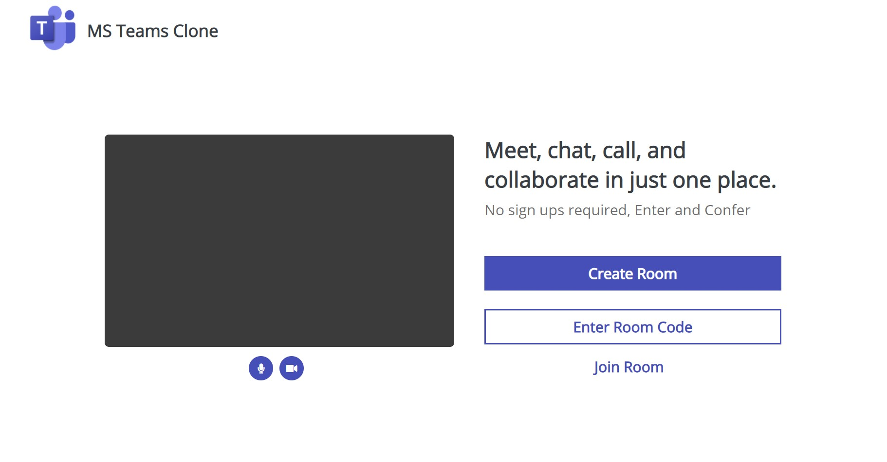

# MS-Teams-Clone-Engage21
A fully functional video conferencing web application where 2 or more people can confer, chat, call and collaborate with each other(basically a clone of MS Teams)

  

### Tech Stack
* WebRTC Technology for real-time peer-to-peer audio and video communication and Node.js.
* Express library to serve static files for UI.
* Socket.io library to establish connection between two devices and data exchange with WebSockets.

### Features Developed
* Video Conferencing
* Chat
* Collaborative Whiteboard
* No Sign ups required and user can create room or enter a room with a room code!

